# From Ancient Frost to Cutting-Edge Design


> "The White Walkers sleep beneath the ice for thousands of years. And when they wake up..."  
> "And when they wake up... what?"  
> "I hope the Wall is high enough."

The Wall is a massive fortification being built along the northern border of the Seven Kingdoms. It is 30 feet tall, made of solid ice. The Sworn Brothers of the Night's Watch manage the construction, ensuring that there are enough crews for completing the work in time, despite the harsh conditions and constant threat from beyond the Wall.

***Disclaimer**: This project is inspired by fictional elements from the popular "Game of Thrones" universe. While the narrative references are thematic, the core functionality of the application is designed for technical demonstration purposes and does not directly relate to the fictional context.*

---

# Table of Contents
[**1. Project overview**](#1-project-overview)

[**2. Features**](#2-features)

[**3. Dependencies**](#3-dependencies)

[**4. Installation Instructions**](#4-installation-instructions)  

&emsp;[***4.1 Windows + Docker Desktop***](#41-windows--docker-desktop)  
&emsp;&emsp;[4.1.1 Fast-Track Demo Setup](#411-fast-track-demo-setup)  
&emsp;&emsp;[4.1.2 Local Development Setup](#412-local-development-setup)  
&emsp;&emsp;[4.1.3 Production Setup (v1)](#413-production-setup-v1)  
&emsp;&emsp;[4.1.4 Production Setup (v2)](#414-production-setup-v2)  

&emsp;[***4.2 Linux + Docker + Docker Compose***](#42-linux--docker--docker-compose)  
&emsp;&emsp;[4.2.1 Fast-Track Demo Setup](#421-fast-track-demo-setup)  
&emsp;&emsp;[4.2.2 Local Development Setup](#422-local-development-setup)  
&emsp;&emsp;[4.2.3 Production Setup (v1)](#423-production-setup-v1)  
&emsp;&emsp;[4.2.4 Production Setup (v2)](#424-production-setup-v2)  

[**5. API Endpoints and Rate Limits**](#5-api-endpoints-and-rate-limits)

[**6. Functional Overview**](#6-functional-overview)  

&emsp;[***6.1 General Workflow***](#61-general-workflow)  

&emsp;[***6.2 Application Functionality***](#62-application-functionality)  
&emsp;&emsp;[6.2.1 Wall characteristics](#621-wall-characteristics)  
&emsp;&emsp;[6.2.2 User Management](#622-user-management)  
&emsp;&emsp;[6.2.3 Configuration File Management](#623-configuration-file-management)  
&emsp;&emsp;[6.2.4 Number of crews parameter](#624-number-of-crews-parameter)  
&emsp;&emsp;[6.2.5 Cost and ice usage calculations](#625-cost-and-ice-usage-calculations)


&emsp;[***6.3 Operational Limitations***](#63-operational-limitations)  

[**7. Author**](#7-author)  

[**8. Status**](#8-status)  

<br>

---

## 1. Project overview


- The **Wall API** is a **Django REST Framework (DRF)** portfolio project that demonstrates the integration of various containerized services within a complex multiprocessing workflow. The API simulates the construction of a massive wall in a fictional world, tracking material quantities and costs across multiple profiles and sections.  
- If the number of construction crews is not specified in the API request, the simulation runs **sequentially**. In this mode, each wall section is assigned to its own designated crew, and the calculations are performed in the main thread.  
- When the number of crews is specified, the simulation runs in **concurrent mode**, in which the application starts a separate thread (or process) for each crew. Once a crew finishes its assigned section, it is dynamically reassigned to the next unfinished section until all sections are completed.  
- In both modes, the heights of all unfinished sections are incremented by one before the build continues to the next simulated day, emulating a realistic construction progress. 
- **The construction progress in concurrent mode is intentionally stored in a logfile in real-time, instead of being calculated in-memory, emulating the synchronization between crews at the end of each day**.


## 2. Features

<details open>
<summary></summary>
  
- **Sequential and concurrent construction simulation**  
  *Supports both sequential and concurrent simulations, depending on the parameters provided in the user request.*

- **Swagger-UI for direct user interaction**  
  *Provides an interactive API documentation interface, allowing users to explore and test API endpoints directly.*  
  *ReDoc is also available.*

- **API endpoints for user account management**  
  *Exposes endpoints for creating, updating, deleting, and managing of user accounts.*  

- **API endpoints for user file management**  
  *Allows users to upload, list, and delete wall configuration files associated with their accounts.*

- **API endpoints for querying construction progress and cost overview**  
  *Provides endpoints to query ice usage and associated construction costs for each section of the wall.*

- **User authentication**  
  *Enables secure user authentication to access the API, supporting personalized interactions and data management.*

- **Database storage**  
  *All relevant data, including user information, wall configurations, and construction progress, is stored in a robust database.*

- **In-memory cache**  
  *Speeds up frequently accessed data by using an in-memory cache, optimizing performance for repeated queries and operations.*

- **Distributed task processing**  
  *Handles heavy computational tasks asynchronously, ensuring seamless user experience without delays in responses.*

- **Task scheduling**  
  *Facilitates scheduling of tasks, allowing for periodic execution of archiving and cleaning jobs.*

- **Throttling**  
  *Implements throttling to limit the rate at which API requests can be performed, preventing server overload.*

</details>

## 3. Dependencies

<details open>
<summary></summary>
<br>

| Dependency                          | Description                                 | Version *(Docker image version)* |
| :---------------------------------- | :------------------------------------------ | :------------------------------: |
| **Python**                          | Main programming language                   |               3.11               |
| **Django**                          | Web framework                               |              5.1.2               |
| **Django Rest Framework**           | API framework                               |              3.15.2              |
| **PostgreSQL**<br>*psycopg2*        | Database engine                             |    *(Docker: 15.3)*<br>2.9.10    |
| **Redis**                           | In-memory cache & Celery broker             |     5.2.0 *(Docker: 7.4.1)*      |
| **Celery**                          | Asynchronous task processing                |              5.4.0               |
| **Djoser**                          | User authentication                         |              2.3.1               |
| **DRF Spectacular**                 | API schema & docs generation                |              0.27.2              |
| **Poetry**                          | Dependency management and<br>virtualization |              1.8.3               |
| **Docker**<br>*Engine*<br>*Compose* | Containerization tools                      |    4.37.1<br>27.4.1<br>2.32.1    |

<br>

💡 *Refer to [pyproject.toml](https://github.com/Alexandar83/the-wall-api/blob/main/pyproject.toml) for the full list with version details for each dependency*  
<br>

</details>

## 4. Installation Instructions

<details open>
<summary></summary>

### 4.1 Windows + Docker Desktop

<details>
<summary></summary>

💻 ***Prerequisites:***  

&emsp;⚙️**Docker Desktop**  

&emsp;⚙️**Python 3.11 or higher**

&emsp;⚙️**Pip**

&emsp;⚙️**Git**  

---

#### 4.1.1 **Fast-Track Demo Setup**

<details>
<summary></summary>

#### 4.1.1.1 Quick app setup  

  - **a.** Download ***`docker-compose-demo.yml`***, located in the ***`config/docker/`*** folder of the repository.  
  - **b.** Pull the app and directly start it with all of its services:

    ```bash
    docker compose -p the-wall-api-demo -f docker-compose-demo.yml up -d

    ```

    💡 *The command must be executed from the folder, where the **`docker-compose-demo.yml`** file is located.*  
    <br>

  - **c.** Send requests to the API endpoints:

    - *http://localhost:8000/api/v1/*
    - *http://localhost:8000/api/v1/swagger-ui/*
  
  - **d.** To stop the app:

    ```bash
    docker compose -p the-wall-api-demo -f docker-compose-demo.yml down
    
    ```  
<br>
  
📌 ***Action required:** To use the other setups, remove all images and volumes, related to the app and the Celery services:*

  ```bash
  docker volume rm the_wall_api_redis_data_demo
  docker volume rm the_wall_api_postgres_data_demo
  docker volume rm the_wall_api_celery_beat_schedule_demo
  docker volume rm the_wall_api_shared_sim_logs_demo
  docker rmi ghcr.io/alexandar83/the-wall-api-demo
  docker rmi ghcr.io/alexandar83/celery-lightweight-demo

  ```  
<br>

🗒️ ***Note:*** *The images for the **Redis**, **PostgreSQL**, and **Busybox** services may be reused in all setups.*  
<br>

💡 *Verify that the volumes and images are removed:*

  ```bash
  docker volume ls
  docker images

  ```  

💡 *If either of the images becomes untagged, it has to be removed by its image id:* 

  ```bash
  docker rmi <image_id>
  ```
<br>

⚠️ ***Disclaimer**: The demo image and **`docker-compose-demo.yml`** are designed for quick setup and portability, intentionally omitting security and sensitive data considerations to streamline demonstration purposes. Please note, the application retains its full feature set.*  
<br>

💡 *If on **Linux**, return to **Linux + Docker + Docker Compose** - [4.2.1.2 Instructions for proxy wall creation (no Docker dependency)](#4212-instructions-for-proxy-wall-creation-no-docker-dependency).*  
<br>

#### 4.1.1.2 Instructions for proxy wall creation (no Docker dependency)  
- **a.** Clone the repository in a folder of your choice:

  ```bash
  git clone https://github.com/Alexandar83/the-wall-api.git
  cd the-wall-api
  
  ```

- **b.** Install Poetry *(for dependency management and virtualization)*:

  ```bash
  pip install poetry

  ```  
<br>

***📝 All subsequent console commands in this section must be executed from the project's root folder (`the-wall-api`).***  
<br>

- **c.** Install app dependencies:

  ```bash
  poetry install

  ```

- **d.** Start a virtual environment:

  ```bash
  poetry shell

  ```

- **e.** Run the proxy wall creation simulation:

  ```bash
  python the_wall_api/utils/proxy_wall_creation.py

  ```  

  ℹ️ ***`proxy_wall_creation.py`** script information:*  
  - *Encapsulates the core multiprocessing logic of the simulation, independent of the broader application context.*
  - *Serves as an entry point for local exploratory debugging and testing of build simulations.*  

  - ***Script parameters:***

    - ***`CONCURRENT_SIMULATION_MODE`** - Input in the `@override_settings` decorator (more details in the proxy_wall_creation.py file).*  
    - ***`num_crews`** - Number of crews working on the build. If 0 or >= total number of wall sections is input, a build simulation in sequential mode is performed.*  
    - ***`wall_construction_config`** - The wall configuration - nested list of lists of integers. Example: [[1, 2, 3], [4, 5, 6], [7, 8, 9]].*

</details><!--/4.1.1-->

---

#### **4.1.2 Local Development Setup**

<details>
<summary></summary>

- **a.** Install Poetry *(for dependency management and virtualization)*:

  ```bash
  pip install poetry

  ```

- **b.** Clone the repository in a folder of your choice:

  ```bash
  git clone https://github.com/Alexandar83/the-wall-api.git
  cd the-wall-api

  ```  


- **c.** Set up the DEV environment configuration:

  - Ensure the following files are set up in the repository folder:

    - ***`config/envs/common/redis.conf`***
    - ***`config/envs/dev/postgres_dev.env`***
    - ***`config/envs/dev/the_wall_api_dev.env`***  

    💡 *Check the \*.example files in the relevant folders of the repository for example configuration values.*  
    
<br>

***📝 All subsequent console commands in this section must be executed from the project's root folder (`the-wall-api`).***  
<br>

- **d.** Install app dependencies:

  ```bash
  poetry install

  ```

- **e.** Workflow to start and manage the application:

  *1.* Start a virtual environment:

    ```bash
    poetry shell

    ```
    
  *2.* Start all dockerized services:  

    ```bash
    config/docker/scripts/docker-compose-dev+migrations.sh

    ```  
    ℹ️ ***`docker-compose-dev+migrations.sh`** script information:*  
    
    - *Pulls the required Redis and PostgreSQL images.*
    - *Ensures Redis and PostgreSQL services are started before proceeding.*  
    - *Waits until PostgreSQL is fully operational before applying Django migrations.*  
    - *Creates the logs folder for application logging.*  
    - *Initiates Docker image builds for the application.*  
    - *Starts Celery services only after the required image is successfully built.*  
    <br>

  *3.* Start a local Django development server:
  
    ```bash
    python manage.py runserver

    ```

  *4.* Send requests to the API endpoints:
  
    - *http://localhost:8000/api/v1/*
    - *http://localhost:8000/api/v1/swagger-ui/*

  *5.* Create a super user:

    ```bash
    python manage.py createsuperuser

    ``` 

  *6.* Access the built-in Django admin panel:

    - *http://localhost:8000/admin/*  
    
      💡 *The local Django development server must be running.*  
    <br>

  *7.* To stop the app:

    ```bash
    docker compose -p the-wall-api-dev -f config/docker/docker-compose-dev.yml down

    ```
<br>

📌 ***Action required:** To use the other setups, remove all images and volumes, related to the app and the Celery services:*

  ```bash
  docker volume rm the_wall_api_redis_data_dev
  docker volume rm the_wall_api_postgres_data_dev
  docker volume rm the_wall_api_celery_beat_schedule_dev
  docker rmi ghcr.io/alexandar83/the-wall-api
  docker rmi ghcr.io/alexandar83/celery-lightweight

  ```
<br>

🗒️ ***Note:*** *The images for the **Redis**, **PostgreSQL**, and **Busybox** services may be reused in all setups.*  
<br>

💡 *Verify that the volumes and images are removed:*

  ```bash
  docker volume ls
  docker images

  ```

💡 *If either of the images becomes untagged, it has to be removed by its image id:* 

  ```bash
  docker rmi <image_id>
  ```
<br>

</details><!--/4.1.2-->
  
---

#### 4.1.3 **Production Setup (v1)**

<details>
<summary></summary>
<br>

***📝 All console commands in this section must be executed from the folder, where the `config` folder is placed.***  
<br>

- **a.** Set up the PROD(v1) environment configuration:

  - Ensure the following folder structure and files are placed in a folder of your choice:

    - ***`config/envs/common/redis.conf`***
    - ***`config/envs/prod/postgres_prod.env`***
    - ***`config/envs/prod/redis_prod.env`***
    - ***`config/envs/prod/the_wall_api_prod.env`***  

    💡 *Check the \*.example files in the relevant folders of the repository for example configuration values.*  
    <br>

- **b.** Set up docker compose:
  - Ensure the ***`docker-compose-prod-v1.yml`*** file from the repository is placed in the ***`config/docker/`*** folder.  
<br>

🗒️ ***Note:*** *The files and folders outlined in sections **a.** and **b.** are sufficient to initialize and start the app without any additional files from the repository.*
<br>

- **c.** Workflow to start and manage the application:  

  *1.* Start the app, the Redis and PostgreSQL services, the Celery workers and the Celery beat service:

    ```bash
    docker compose -p the-wall-api-prod -f config/docker/docker-compose-prod-v1.yml up -d

    ```

  *2.* Send requests to the API endpoints:

    - *http://localhost:8000/api/v1/swagger-ui/*
    
  *3.* To stop the app:

    ```bash
    docker compose -p the-wall-api-prod -f config/docker/docker-compose-prod-v1.yml down

    ```
<br>

📌 ***Action required:** To use the other setups, remove all images and volumes, related to the app and the Celery services:*

  ```bash
  docker volume rm the_wall_api_redis_data_prod
  docker volume rm the_wall_api_postgres_data_prod
  docker volume rm the_wall_api_celery_beat_schedule_prod
  docker volume rm the_wall_api_shared_sim_logs_prod
  docker rmi ghcr.io/alexandar83/the-wall-api
  docker rmi ghcr.io/alexandar83/celery-lightweight

  ```
<br>

🗒️ ***Note:*** *The images for the **Redis**, **PostgreSQL**, and **Busybox** services may be reused in all setups.*  
<br>

💡 *Verify that the volumes and images are removed:*

  ```bash
  docker volume ls
  docker images

  ```

💡 *If either of the images becomes untagged, it has to be removed by its image id:* 

  ```bash
  docker rmi <image_id>
  ```
<br>

💡 *If on **Linux**, return to **Linux + Docker + Docker Compose** - [4.2.4 Production Setup (v2)](#424-production-setup-v2).*  
<br>

</details><!--/4.1.3-->
  
---

#### 4.1.4 **Production Setup (v2)**

<details>
<summary></summary>
<br>

***📝 All console commands in this section must be executed from the folder, where the `config` folder is placed.***  
<br>

- **a.** Set up the PROD(v2) environment configuration:

  - Ensure the following folder structure and files are placed in a folder of your choice:
    
    *1.* Application configuration files:
      - ***`config/envs/common/redis.conf`***
      - ***`config/envs/prod/the_wall_api_prod.env`***
    
    *2.* *3.* Docker secrets files *(containing the PostgreSQL and Redis credentials)*:
      - ***`config/secrets/postgres_db.txt`***
      - ***`config/secrets/postgres_password.txt`***
      - ***`config/secrets/postgres_user.txt`***
      - ***`config/secrets/redis_password.txt`***  

    💡 *Check the \*.example files in the **`config/envs/`** and **`config/secrets/`** folders of the repository for example values.*  
    <br>

- **b.** Init docker swarm mode

  ```bash
  docker swarm init

  ```

- **c.** Create the host machine docker secrets for the PostgreSQL and Redis passwords:

  ```bash
  docker secret create postgres_db config/secrets/postgres_db.txt
  docker secret create postgres_password config/secrets/postgres_password.txt
  docker secret create postgres_user config/secrets/postgres_user.txt
  docker secret create redis_password config/secrets/redis_password.txt

  ```  

  💡 *Verify that the secrets are created correctly:*

  ```bash
  docker secret ls

  ```
  
🗒️ ***Note:*** *Secrets are securely mounted as files when the app's docker containers are initialized, allowing the relevant services to use them during runtime. In docker swarm mode, secrets are encrypted and securely managed by the swarm manager, ensuring credentials are not hardcoded insecurely.*  


❗ ***Important:** In real-life scenarios backup the passwords and remove the secrets files from the `config/secrets/` folder after the secrets are created.*  
<br>

- **d.** Docker stack deploy:
  - Ensure the ***`docker-compose-prod-v2.yml`*** file from the repository is placed in the ***`config/docker/`** folder.*  
<br>

🗒️ ***Note:*** *Once the secrets are created in the system, the files and folders outlined in sections **a.1** and **d.** are sufficient to initialize and start the app without additional files.*

- **e.** Workflow to start and manage the application:  
  
  *1.* Start the app, the Redis and PostgreSQL services, the Celery workers and the Celery beat service by deploying the prod_stack:

    ```bash
    docker stack deploy -c config/docker/docker-compose-prod-v2.yml prod_stack --detach=true

    ```  

  💡 *Verify that all containers in the stack are running:*  

    ```bash
    docker stack ps prod_stack  
    ```  
    <br>

  *2.* Send requests to the API endpoints:

    - *http://localhost:8000/api/v1/swagger-ui/*

  *3.* To stop the app:

    ```bash
    docker stack rm prod_stack

    ```
  <br>

📌 ***Action required:** To use the other setups, remove all images and volumes, related to the app and the Celery services:*  

- 💡 *Verify that there are no running containers first:*

  ```bash
  docker stack ps prod_stack

  ```

- 💡 *When all containers are stopped:*

  ```bash
  docker volume rm the_wall_api_redis_data_prod
  docker volume rm the_wall_api_postgres_data_prod
  docker volume rm the_wall_api_celery_beat_schedule_prod
  docker volume rm the_wall_api_shared_sim_logs_prod
  docker rmi ghcr.io/alexandar83/the-wall-api
  docker rmi ghcr.io/alexandar83/celery-lightweight

  ```
<br>

🗒️ ***Note:*** *The images for the **Redis**, **PostgreSQL**, and **Busybox** services may be reused in all setups.*  
<br>

- 💡 *Verify that the volumes and images are removed:*

  ```bash
  docker volume ls
  docker images

  ```

- 💡 *If either of the images becomes untagged, it has to be removed by its image id:* 

  ```bash
  docker rmi <image_id>
  ```
<br>

</details><!--/4.1.4-->

</details><!--/4.1-->

---

### 4.2 Linux + Docker + Docker Compose

🗒️ ***Note:*** *Tested on Ubuntu (WSL2)*

<details>
<summary></summary>

💻 ***Prerequisites:***  

&emsp;⚙️**Docker**  

&emsp;⚙️**Docker Compose**  

&emsp;⚙️**Python 3.11 or higher**  

&emsp;⚙️**Git**  

---

#### 4.2.1 **Fast-Track Demo Setup**

<details>
<summary></summary>

#### 4.2.1.1 Quick app setup
💡 *Refer to **Windows + Docker Desktop instuructions** - [4.1.1.1 Quick app setup](#4111-quick-app-setup).*  
<br>

#### 4.2.1.2 Instructions for proxy wall creation (no Docker dependency)  

- **a.** Clone the repository in a folder of your choice:

  ```bash
  git clone https://github.com/Alexandar83/the-wall-api.git
  cd the-wall-api
  
  ```
<br>

***📝 All subsequent console commands in this section must be executed from the project's root folder (`the-wall-api`).***  
<br>

- **b.** Install system dependencies:

  ```bash
  config/linux/linux_install_prerequisites.sh --deployment_mode=demo

  ```
  ℹ️ ***`linux_install_prerequisites.sh`** script information:*  

  - *Installs tools and libraries for PostgreSQL development.*  
  - *Installs Poetry and adds it to PATH.*  
  - *When **`--deployment_mode`**=**`demo`**, uses the bundled **`the_wall_api_dev.env.example`** file to load the environment variables, required to complete the installation.*  
  
  💡 *Restart your shell to apply the Poetry changes to PATH.*  
  <br><br>

- **c.** Install app dependencies:

  ```bash
  poetry install

  ```

- **d.** Start a virtual environment:

  ```bash
  poetry shell

  ```

- **e.** Run the proxy wall creation simulation:

  ```bash
  python the_wall_api/utils/proxy_wall_creation.py

  ```  

  ℹ️ ***`proxy_wall_creation.py`** script information:*  

  - *Encapsulates only the core multiprocessing logic of the simulation, independent of the broader application context.*
  - *Serves as an entry point for local exploratory debugging and testing of build simulations.*

  - ***Script parameters:***

    - ***`CONCURRENT_SIMULATION_MODE`** - Input in the `@override_settings` decorator (more details in the proxy_wall_creation.py file).*  
    - ***`num_crews`** - Number of crews working on the build. If 0 or >= total number of wall sections is input, a build simulation in sequential mode is performed.*  
    - ***`wall_construction_config`** - The wall configuration - nested list of lists of integers. Example: [[1, 2, 3], [4, 5, 6], [7, 8, 9]].*

</details><!--/4.2.1-->

---

#### **4.2.2 Local Development Setup**

<details>
<summary></summary>

- **a.** Clone the repository in a folder of your choice:

  ```bash
  git clone https://github.com/Alexandar83/the-wall-api.git
  cd the-wall-api
  
  ```

- **b.** Set up the DEV environment configuration:

  - Ensure the following files are set up in the repository folder:

    - ***`config/envs/common/redis.conf`***
    - ***`config/envs/dev/postgres_dev.env`***
    - ***`config/envs/dev/the_wall_api_dev.env`***

    💡 *Check the \*.example files in the relevant folders of the repository for example configuration values.*  
<br>

***📝 All subsequent console commands in this section must be executed from the project's root folder (`the-wall-api`).***  
<br>

- **c.** Install system dependencies:
  ```bash
  config/linux/linux_install_prerequisites.sh

  ```
  ℹ️ ***`linux_install_prerequisites.sh`** script information:*  

  - *Installs tools and libraries for PostgreSQL development*
  - *Installs Poetry and adds it to PATH.*
  - *When **`--deployment_mode`** is not provided in the call:* 
  
    - *Creates a dedicated group to manage shared access to the mounted logs folder (used in docker compose). This group allows both the root user and the application user in the Celery services' containers to access the logs.*
    - *Requires the **`APP_GROUP_ID`**, and **`APP_GROUP_NAME`** env. vars from the **`the_wall_api_dev.env`** file (refer to section **b.**).*  

  
  💡 *Restart your shell to apply the Poetry changes to PATH.*  
  <br>
  🗒️ ***Note:** The script can be re-run if its execution was interrupted or incomplete.*  
  <br><br>

- **d.** Install app dependencies:

  ```bash
  poetry install

  ```

- **e.** Workflow to start and manage the application:

  *1.* Start a virtual environment:

    ```bash
    poetry shell

    ```
    
  *2.* Start all dockerized services:  

    ```bash
    config/docker/scripts/docker-compose-dev+migrations.sh

    ```  

    ℹ️ ***`docker-compose-dev+migrations.sh`** script information:*  

    - *Pulls the required Redis and PostgreSQL images.*
    - *Ensures Redis and PostgreSQL services are started before proceeding.*  
    - *Waits until PostgreSQL is fully operational before applying Django migrations.*  
    - *Creates the logs folder for application logging.*  
    - *Sets the group ownership for the logs folder to the newly created group (refer to section **c.**).*
    - *Initiates Docker image builds for the application.*  
      - *Depends on the following environment variables, defined in **`the_wall_api_dev.env`**: **`LOGS_DIR_NAME`**, **`APP_USER_ID`**, **`APP_GROUP_ID`**, and **`APP_GROUP_NAME`**. The variables are used to:*
        - *Create the logs folder within the Celery services' containers.*
        - *Establish a new group in the Celery services' containers.*
        - *Create a non-root app user in the Celery services' containers and add it to the new group.*
        - 🗒️ ***Note:*** *These actions ensure both the root user and the app user have shared access to the mounted logs folder.*
    - *Starts Celery services only after the required image is successfully built.*  
    <br>

  *3.* Start a local Django development server:

    ```bash
    config/linux/refresh_allowed_hosts_wsl2.sh --deployment_mode=dev
    python manage.py runserver 0.0.0.0:8000

    ```
    #### ℹ️ *`refresh_allowed_hosts_wsl2.sh` script information:*  

    - *Configures the **`ALLOWED_HOSTS`** environment variable by:*  

      - *Removing any outdated **`WSL2 IP`** addresses from the **`ALLOWED_HOSTS`**.*
      - *Adding the current **`WSL2 IP`** address to the **`ALLOWED_HOSTS`**.*
      - *The environment file in which the modifications are made is determined, based on the **`--deployment_mode` (required)** argument:*  

        - ***`--deployment_mode=dev`** &nbsp;->&nbsp; **`config/envs/dev/the_wall_api_dev.env`***  

        - ***`--deployment_mode=prod_v2`** &nbsp;->&nbsp; **`config/envs/prod/the_wall_api_prod.env`***  
    - *Outputs the current **`WSL2 IP`** address in the console, helping the user determine where the application is accessible.*  
    <br>

  *4.* Send requests to the API endpoints, using the current ***`WSL2 IP`*** address:

    - *http://**`WSL2 IP`**:8000/api/v1/*
    - *http://**`WSL2 IP`**:8000/api/v1/swagger-ui/*

  *5.* Create a super user:

    ```bash
    python manage.py createsuperuser

    ```

  *6.* Access the built-in Django admin panel:

    - *http://**`WSL2 IP`**:8000/admin/*  

      💡 *The local Django development server must be running.*  
      <br>
  
  *7.* To stop the app:

    ```bash
    docker compose -p the-wall-api-dev -f config/docker/docker-compose-dev.yml down

    ```
  <br>

📌 ***Action required:** To use the other setups, remove all images and volumes, related to the app and the Celery services:*

  ```bash
  docker volume rm the_wall_api_redis_data_dev
  docker volume rm the_wall_api_postgres_data_dev
  docker volume rm the_wall_api_celery_beat_schedule_dev
  docker rmi ghcr.io/alexandar83/the-wall-api
  docker rmi ghcr.io/alexandar83/celery-lightweight

  ```
<br>

🗒️ ***Note:*** *The images for the **Redis**, **PostgreSQL**, and **Busybox** services may be reused in all setups.*  
<br>

💡 *Verify that the volumes and images are removed:*

  ```bash
  docker volume ls
  docker images

  ```

💡 *If either of the images becomes untagged, it has to be removed by its image id:* 

  ```bash
  docker rmi <image_id>
  ```
<br>

</details><!--/4.2.2-->
  
---

#### 4.2.3 **Production Setup (v1)**
💡 *Refer to **Windows + Docker Desktop instuructions** - [4.1.3 Production Setup (v1)](#413-production-setup-v1).*  

---

#### 4.2.4 **Production Setup (v2)**

<details>
<summary></summary>
<br>

***📝 All console commands in this section must be executed from the folder, where the `config` folder is placed.***  
<br>

- **a.** Set up the PROD(v2) environment configuration:

  - Ensure the following folder structure and files are placed in a folder of your choice:
    
    *1.* Application configuration files:

      - ***`config/envs/common/redis.conf`***      
      - ***`config/envs/prod/the_wall_api_prod.env`***
    
    💡 *Check the \*.example files in the **`config/envs/`** folder of the repository for example values.*  
    <br>

    *2.* Linux scripts files:
    
      - ***`config/linux/refresh_allowed_hosts_wsl2.sh`***
      - ***`config/linux/common_utils.sh`***  
  
    💡 *If the files were manually copied or downloaded instead of using git clone, ensure that they have executable permissions:*

      ```bash
      chmod +x config/linux/refresh_allowed_hosts_wsl2.sh
      chmod +x config/linux/common_utils.sh

      ```
    <br>

    *3.* Docker secrets files *(containing the PostgreSQL and Redis credentials)*:
      - ***`config/secrets/postgres_db.txt`***
      - ***`config/secrets/postgres_password.txt`***
      - ***`config/secrets/postgres_user.txt`***
      - ***`config/secrets/redis_password.txt`***  
    
    💡 *Check the \*.example files in the **`config/secrets/`** folder of the repository for example values.*  
    <br>

- **b.** Init docker swarm mode

  ```bash
  docker swarm init

  ```

- **c.** Create the host machine docker secrets for the PostgreSQL and Redis passwords:

  ```bash
  docker secret create postgres_db config/secrets/postgres_db.txt
  docker secret create postgres_password config/secrets/postgres_password.txt
  docker secret create postgres_user config/secrets/postgres_user.txt
  docker secret create redis_password config/secrets/redis_password.txt

  ```

  💡 *Verify that the secrets are created correctly:*

  ```bash
  docker secret ls

  ```


🗒️ ***Note:*** *Secrets are securely mounted as files when the app's docker containers are initialized, allowing the relevant services to use them during runtime. In docker swarm mode, secrets are encrypted and securely managed by the swarm manager, ensuring credentials are not hardcoded insecurely.*  

 
❗ ***Important:** In real-life scenarios backup the passwords and remove the secrets files from the `config/secrets/` folder after the secrets are created.*  
<br>

- **d.** Docker stack deploy:
  - Ensure the ***`docker-compose-prod-v2.yml`*** file from the repository is placed in the ***`config/docker/`** folder.*  
<br>

🗒️ ***Note:*** *Once the secrets are created in the system, the files and folders outlined in sections **a.1**, **a.2**, and **d.** are sufficient to initialize and start the app without any additional files from the repository.*  
<br>
- **e.** Workflow to start and manage the application:  
  
  *1.* Start the app, the Redis and PostgreSQL services, the Celery workers and the Celery beat service by deploying the prod_stack:

    ```bash
    config/linux/refresh_allowed_hosts_wsl2.sh --deployment_mode=prod_v2
    docker stack deploy -c config/docker/docker-compose-prod-v2.yml prod_stack --detach=true

    ```
    ℹ️ ***`refresh_allowed_hosts_wsl2.sh`*** [*script information*](#ℹ️-refresh_allowed_hosts_wsl2sh-script-information)


  💡 *Verify that all containers in the stack are running:*  

    ```bash
    docker stack ps prod_stack  
    ```  
    <br>

  
  *2.* Send requests to the API endpoints:

    - *http://**`WSL2 IP`**:8000/api/v1/swagger-ui/*  

      💡 *Refer to **`refresh_allowed_hosts_wsl2.sh`** [*script information*](#ℹ️-refresh_allowed_hosts_wsl2sh-script-information) for **`WSL2 IP`** details.*  
    <br>

  *3.* To stop the app:

    ```bash
    docker stack rm prod_stack

    ```
  <br>

📌 ***Action required:** To use the other setups, remove all images and volumes, related to the app and the Celery services:*  


- 💡 *Verify that there are no running containers first:*

  ```bash
  docker stack ps prod_stack

  ```

- 💡 *When all containers are stopped:*

  ```bash
  docker volume rm the_wall_api_redis_data_prod
  docker volume rm the_wall_api_postgres_data_prod
  docker volume rm the_wall_api_celery_beat_schedule_prod
  docker volume rm the_wall_api_shared_sim_logs_prod
  docker rmi ghcr.io/alexandar83/the-wall-api
  docker rmi ghcr.io/alexandar83/celery-lightweight

  ```
<br>

🗒️ ***Note:*** *The images for the **Redis**, **PostgreSQL**, and **Busybox** services may be reused in all setups.*  
<br>

- 💡 *Verify that the volumes and images are removed:*

  ```bash
  docker volume ls
  docker images

  ```

- 💡 *If either of the images becomes untagged, it has to be removed by its image id:* 

  ```bash
  docker rmi <image_id>
  ```
<br>

</details><!--/4.2.4-->

</details><!--/4.2-->

</details><!--/4.-->

---

## 5. API Endpoints and Rate Limits

<details open>
<summary></summary>

### Base URL

- Windows + Docker Desktop: ***`http://localhost:8000/`***

- Linux + Docker + Docker Compose: ***`http://<WSL2 IP>:8000/`***

### Endpoints

| Endpoint                | URL                                                     | Requires token authentication |            Rate limit scopes            |
| ----------------------- | ------------------------------------------------------- | :---------------------------: | :-------------------------------------: |
| Create User             | `/api/v1/auth/users/`                                   |              No               |             Unauthenticated             |
| Set Password            | `/api/v1/auth/users/set_password/`                      |              Yes              |             User management             |
| Login (authenticate)    | `/api/v1/auth/token/login/`                             |              No               |  Authenticated + <br>Unauthenticated 🗒️  |
| Logout (revoke token)   | `/api/v1/auth/token/logout/`                            |              Yes              |             User management             |
| Delete User             | `/api/v1/auth/users/me/{username}/`                     |              Yes              | User management + <br>Unauthenticated 🗒️ |
| Upload File             | `/api/v1/wallconfig-files/upload/`                      |              Yes              |             File management             |
| List Files              | `/api/v1/wallconfig-files/list/`                        |              Yes              |              Authenticated              |
| Delete File             | `/api/v1/wallconfig-files/delete/`                      |              Yes              |             File management             |
| Profile Daily Overview  | `/api/v1/profiles/<int:profile_id>/overview/<int:day>/` |              Yes              |              Authenticated              |
| Profiles Daily Overview | `/api/v1/profiles/overview/<int:day>/`                  |              Yes              |              Authenticated              |
| Profiles Overview       | `/api/v1/profiles/overview/`                            |              Yes              |              Authenticated              |
| Profile Daily Ice Usage | `/api/v1/profiles/<int:profile_id>/days/<int:day>/`     |              Yes              |              Authenticated              |

<br>

🗒️ ***Note:** **Unauthenticated** and **Authenticated** rate limits are tracked separately, and the counters do not reset. Instead, they dynamically switch depending on the user's authentication state.*  

🗒️ ***Note:**  **Deleting a user** requires authentication at the start of the request. However, once the user account is deleted, the session token is invalidated, and the user becomes unauthenticated. Any subsequent requests to this endpoint will fall under the "Unauthenticated" rate limit scope.*  
<br>

### Rate limit scopes

| Scope                                                    |   Limit   |
| -------------------------------------------------------- | :-------: |
| Unauthenticated (The user is not logged in)              |  5 / min  |
| Authenticated (The user is logged in with a valid token) | 100 / min |
| File management                                          |  5 / min  |
| User management                                          | 10 / min  |

### Detailed API documentation

| Endpoint   | URL                   |
| ---------- | --------------------- |
| Swagger UI | `/api/v1/swagger-ui/` |
| ReDoc      | `/api/v1/redoc/`      |
| Schema     | `/api/v1/schema/`     |

</details>


## 6. Functional Overview

<details open>
<summary></summary>

### 6.1 General Workflow

```mermaid
%%{init: {'theme': 'base'}}%%
graph TD
    A[👤 Create User Account] --> B[🔑 Generate Authentication Token]
    B --> C[📤 Upload Wall Configuration File]
    C --> D[📊 Access Simulation Results]
```

<details>
<summary></summary>



</details><!--/6.1-->

### 6.2 Application Functionality

<details>
<summary></summary>

#### 6.2.1 Wall characteristics

<details>
<summary></summary>

  - **a.** A single construction crew adds one foot of height per day to a section.

  - **b.** A section is complete when it reaches a height of 30 feet.

  - **c.** Each additional foot of height for a section requires 195 cubic yards of ice.

  - **d.** Processing one cubic yard of ice costs 1 900 Gold Dragon coins.

</details><!--/6.2.1-->

#### 6.2.2 **User Management**

<details>
<summary></summary>

  - **a.** Users can create an account by providing their details (**`username`**, **`password`**, `email`*(optional)*) to the ***Create User*** endpoint.

  - **b.** Authentication is required to access the API endpoints:
  
    - Use the ***Login*** endpoint to obtain a new token, or retrieve an already existing one. Newly created tokens are valid until they are explicitly revoked.
    - Tokens must be included in the **`Authorization`** header as **`Token <token>`** in all subsequent requests.

  - **c.** Users can update their password using the ***Set Password*** endpoint.

  - **d.** Users can revoke their tokens via the ***Logout*** endpoint.

  - **e.** Users can delete their account using the ***Delete User*** endpoint.

</details><!--/6.2.2-->

#### 6.2.3 **Configuration File Management**

<details>
<summary></summary>

  - **a.** Uploaded files must meet the following requirements:
    - File Extension: **`.json`**.
    - File Content: Valid JSON data that represents a nested list of lists of integers. 

      ℹ️ *The **outer list** represents the entire wall. The **inner lists** represent individual wall profiles, where each integer indicates the height of a specific profile section.*  
      ***Example:***  
      <i>
      ```json
      [
        [21, 25, 28],
        [17],
        [17, 22, 17, 19, 17]
      ]
      ```
      </i>

  - **b.** Users can retrieve a list of all **`config_id`** wall configuration references associated with their account via the ***List Files*** endpoint.

  - **c.** Users can delete a list of specific **`config_id`** references using the provided ***Delete File*** endpoint.

</details><!--/6.2.3-->

#### 6.2.4 **Number of crews parameter**

<details>
<summary></summary>

  - **a.** The **`num_crews`** parameter is optional and impacts only the behavior of the **`profiles-days`** endpoint.

  - **b.** Default behavior - **`num_crews`** is not provided in the request:
    - Each wall section has its own designated construction crew  
    ℹ️ *This default behavior is also applied if the provided **`num_crews`** parameter is:  
      -Set to **`0`**  
      -Greater than or equal to the number of wall sections*  
      <br>

  - **c.** If the user provides the **`num_crews`** query parameter, the calculations follow these rules:
    - Each crew is assigned to an unfinished section of the wall.
    - When a crew finishes its assigned section, it is reassigned to the next unfinished section.
    - If no unfinished sections remain, the crew is relieved after completing its task.

  - **d.** Common rule (both modes):
    - The heights of all unfinished sections with active crews are incremented by one before the build continues to the next simulated day.

</details><!--/6.2.4-->

#### 6.2.5 **Cost and ice usage calculations**

<details>
<summary></summary>

  - **a.** API Endpoints are available to query ice usage and construction costs for each wall section.

  - **b.** The ***Profiles Overview*** endpoint provides the total cost of the wall in Gold Dragon coins.

  - **c.** The ***Profile Daily Ice Usage*** endpoint provides the ice usage for a specific wall profile on a specific day in cubic yards.

  - **d.** Example use cases:
    <i>
    - A wall configuration file is uploaded:  

      ```json
      [
        [27],
        [27, 27],
        [28, 29, 30]
      ]
      ```
    - **`num_crews`** is not specified - 5 crews are assigned to each unfinished section.
      - Construction process:
        - Profile **`1`** total progress: 30 - 27 = **3 feet**
        - Profile **`2`** total progress: (30 - 27) + (30 - 27) = **6 feet**
        - Profile **`3`** total progress: (30 - 28) + (30 - 29) = **3 feet**
        - Wall total progress = 3 + 6 + 3 = **12 feet** constructed
      - **`profiles-overview`** calculates the total cost of the wall:        
        - Total cost = **12**(feet) \* **195**(cubic yards of ice) \* **1 900**(Gold Dragon coins) = ***4 446 000 Gold Dragon coins***
      - **`profiles-overview/2`** calculates the cost for profile **`2`**:
        - **6**(feet) \* **195**(cubic yards of ice) \* **1 900**(Gold Dragon coins) = **2 223 000 Gold Dragon coins**
      - **`profiles/2/days/2`** calculates the total amount of ice used for profile **`2`** on the **`2nd`** day of the construction:
        - **2**(total feet raised on profile **`2`** on the **`2nd`** day) \* **195**(cubic yards of ice) = **390 cubic yards of ice**
    - **`num_crews`** = **`2`**:
      - Construction process:
          - **Crew `I`** raises profile **`1`** - section **`1`** by **3 feet**.
          - **Crew `II`** raises profile **`2`** - section **`1`** by **3 feet**.
          - At the end of the **`3rd`** day:
            - **Crew `I`** is assigned to work on profile **`2`** - section **`2`**.
              - Raises it by **3 feet**.
            - **Crew `II`** is assigned to work on profile **`3`** - section **`1`**.
              - Raises it by **2 feet**.
          - At the end of the **`5th`** day:
            - **Crew `II`** is assigned to work on profile **`3`** - section **`2`**.
              - Raises it by **1 foot**.
          - At the end of the **`6th`** day:
            - **Crew `I`** is relieved.
            - **Crew `II`** is relieved.
          - Wall total progress = 3 + 3 + 3 + 2 + 1 = **12 feet** constructed.
      
      ℹ️ Only the **`profiles-days`** endpoint supports the `num_crews` parameter.

      - **`profiles/2/days/2?num_crews=2`** calculates the total amount of ice used for profile **`2`** on the **`2nd`** day of the construction:
        - **1**(total feet raised on profile **`2`** on the **`2nd`** day) \* **195**(cubic yards of ice) = **195 cubic yards of ice**.
    </i>

💡 *A valid **`config_id`** for an uploaded wall configuration must be provided for each request.*

ℹ️ *A **`config_id`** serves as a reference to a specific build simulation. This allows for several users to have references to the same simulation, avoiding unnecessary data duplication.*

💡 *Refer to the **`swagger-ui`** and **`redoc`** documentation for detailed description of each endpoint's associated parameters and usage.*

</details><!--/6.2.5-->

</details><!--/6.2-->

### 6.3 Operational limitations

<details>
<summary></summary>

- Password:
  - Password must not be too similar to personal information (like username or email)
  - Password must meet the minimum length requirement (default: 8 characters)
  - Password must not be a commonly used password
  - Password must not be entirely numeric

- Uploaded files:
  - Uploaded file format requirements are described in section [6.2.3 Configuration File Management](#623-configuration-file-management)
  - Maximum file uploads per account: 5
  - All config_id-s uploaded by a user must be unique
  - Maximum allowed length of a config_id: 30

- Wall configurations:
  - Maximum allowed sections in a wall configuration: 2000
  - Starting height for each section is within range [0...30]

</details><!--/6.3-->

</details><!--/6.-->

## 7. Author

#### Aleksandar Dimitrov
- [LinkedIn](https://www.linkedin.com/in/aleksandar-dimitrov-412833316)
- [Yahoo Email](mailto:sasho_1983@yahoo.com)


## 8. Status

#### Working on version 2.0